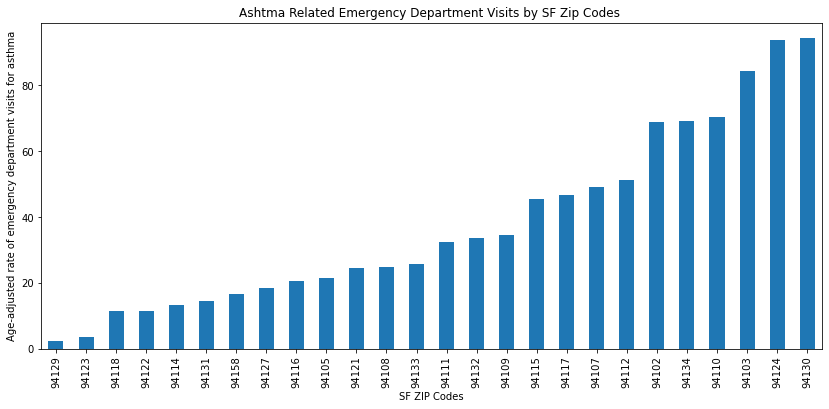
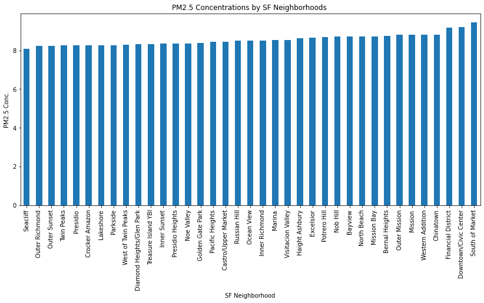
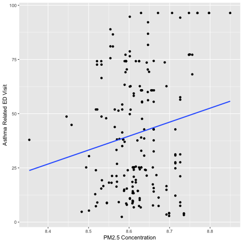
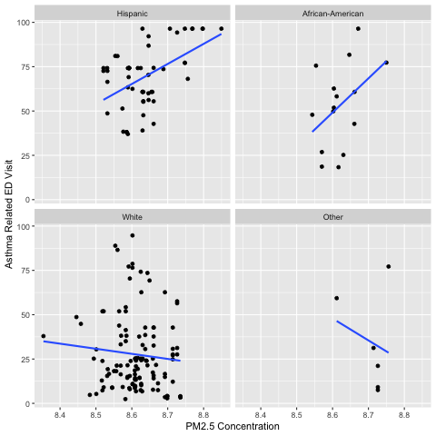

## Welcome to GitHub Pages

You can use the [editor on GitHub](https://github.com/chojolan00/CYP_finalproj/edit/main/README.md) to maintain and preview the content for your website in Markdown files.

Whenever you commit to this repository, GitHub Pages will run [Jekyll](https://jekyllrb.com/) to rebuild the pages in your site, from the content in your Markdown files.

### Markdown

Markdown is a lightweight and easy-to-use syntax for styling your writing. It includes conventions for

```markdown
Syntax highlighted code block

# Header 1
## Header 2
### Header 3

- Bulleted
- List

1. Numbered
2. List

**Bold** and _Italic_ and `Code` text

[Link](url) and 

```

## Assessing the distribution of Age-Adjusted Asthma Hospitalization Rates by San Francisco Zip Codes



## Assessing the distribution of PM2.5 Concentration in San Francisco neighborhoods



## Asthma Related Emergency Department Visits throughout San Francisco Neighborhoods


## PM2.5 Distribution throughout SF Neighborhoods


## Age-Adjusted Asthma Emergency Department Visits by SF Neighborhoods with Percentage of Minority Communities in Different Areas


## Correlation Plot: Assessing Correlation between Ashtma Related Emergecny Department Visits by PM2.5 Concentrations in San Francisco



## Correlation Plot: Asthma Related Emergency Department Visits by PM2.5 Concentrations Stratified by Race/Ethnicity



For more details see [Basic writing and formatting syntax](https://docs.github.com/en/github/writing-on-github/getting-started-with-writing-and-formatting-on-github/basic-writing-and-formatting-syntax).

### Jekyll Themes

Your Pages site will use the layout and styles from the Jekyll theme you have selected in your [repository settings](https://github.com/chojolan00/CYP_finalproj/settings/pages). The name of this theme is saved in the Jekyll `_config.yml` configuration file.

### Support or Contact

Having trouble with Pages? Check out our [documentation](https://docs.github.com/categories/github-pages-basics/) or [contact support](https://support.github.com/contact) and we’ll help you sort it out.
