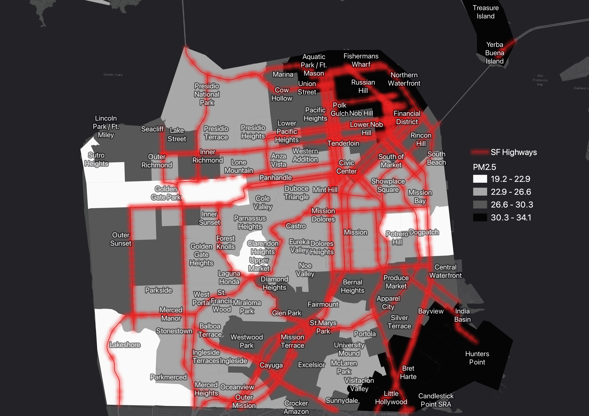

<h1>

 
  
<strong>
The Distribution of PM 2.5 in San Francisco and its Relationship with Ashtma Hospitalization Rates</strong>

</h1>

&nbsp;&nbsp;
## Asthma
In 2017, Asthma related complications resulted in an estimated 1.6 million emerency departments visits throughout the country. The prevalence of ashtma among the United States population was about 8% in 2018. While there has been a decrease in trend on asthma among children, there continues to be inequities that influence asthma related outcomes. According to surveys by the CDC, asthma prevalence was found to be higher among families with a family income of <100% of the federal poverty line. 

## Particulate Matter 2.5 (PM2.5)
Partiuclate matter is a source of air pollution that has shown to have adverse health effects on human health. Emissions of PM2.5 come from a variety of sources such as cars, trucks, industrical industries and other activities involving combustion. Research has shown that particulate matter can excarcerbate pre-exisitng conditions in the heart and lungs. California is one of the states that has 6 counties currently violating the United States Environmental Protection Agency's (EPA) standard. Furthermore, research has also shown the inequities in health outcomes due to exposure to PM2.5 in vulnerable populations such children, pregnant women and communities of color. There are risk factors that puts individuals and commnunities at greater risk for exposure to PM2.5 that can increase their risk for adverse health outcomes. 

## Environmental Injustice
The topic of environmental health has over time focused on environmental health injustices that have been impacted by historical policies and segregation throughout the country. Research has shown that communities of color have been impactd by exposure to environmental burdens at a higher rate than their white counterparts. In addition, study findings have shown that people of color are disproportionately exposed to PM2.5 due to risk factors such as living in proximity to major roadways which has shown to increase the occurrence of chronic respiratory symptoms. Furthermore, research has identified that race is a strong predictor of environmental burdens compared to other risk factors. Overall, there continues to be efforts by the state to mitigate the risk of environmental impacts on communities of color such as the development of the CalEnviroScreen 4.0 tool. In addition, community movements have also raised awareness of the cumulative health impacts of these environmental burdens. 

&nbsp;&nbsp;&nbsp;
### Assessing the distribution of Age-Adjusted Asthma Hospitalization Rates by San Francisco Zip Codes

 
The Distribution of PM 2.5 in San Francisco and its Relationship with Ashtma Hospitalization Rates

After assessing the distribution of age-adjusted asthma hospitalization rates by SF zip codes we identified 4 zip codes of interest:

* 94103: South of Market
* 94124: Hunters Point
* 94110: Inner Mission
* 94134: Portola

In the following maps and graphs, we visually compared the location of these neighborhoods in relation to PM2.5 concentrations, asthma hospitalization rates and percentage of minority populations by neighborhood. 

### Assessing the distribution of PM2.5 Concentration in San Francisco neighborhoods

 
Some of the neighborhoods identified in the previous graph showing high age-adjusted ashtma hospitalization rates also fall under having high concentrations of PM2.5 in this graph showing the distribution of PM2.5 in different SF neighborhoods. 

&nbsp;&nbsp;
### Asthma Related Emergency Department Visits throughout San Francisco Neighborhoods

 
Historically, Bay View Hunter's Point has been known as an area with issues of environmental burdens. In this map we can see that the higher percentile of age-adjusted asthma hospitalization rates are concentrated within the southeast part of San Francisco. Neighborhoods such as the mission, Hunters Point, Portila and others are found to have the highest asthma related emergency department visits in the county. The map also shows the San Francisco highways that travel through these neighborhoods. Research has shown that living in close proximity to highways incrases your exposures to these enviornmental pollutants from traffic related emissions. As previously mentioned, some of these environmental burdens can excarcerbate certain respiratory and cardiovascular conditions. 

&nbsp;&nbsp;
### PM2.5 Distribution throughout SF Neighborhoods

In this map we can visually assess the distribution of PM2.5 throughout San Francisco and the concentration of PM2.5 within certain areas. Like the previous asthma related map. The concentration of PM2.5 can be seen at its highest in the southeast part of the county in the neighborhood of Bayview Hunter's Point. We can also see that some neighborhhod north of Bayview Hunter's Point are also exposed to this pollutant. Shown in red, we can see the highway arteries that run throughout each neighborhood in the city. 

&nbsp;&nbsp;
### Age-Adjusted Asthma Emergency Department Visits by SF Neighborhoods with Percentage of Minority Communities in Different Areas

In regards to our mission to addressing environmental justice, this map is aimed at highlighting the percent of minority populations that reside in areas with high asthma hospitalization rates throughout the county. We can see that when these two layers are joined a great portion of areas with a high asthma related hospitalization rates are home to a great percentage of minority communities. Like previously mentioned, research in the environmental justice literature has found that race is a strong predictor to environmetal burdens compared to other variables or predcitors. Its unfortunate that there is slow progress in addressing these environmental injustices that disproportionately affect peoples health. It is crucial to use data to address some of these issues, in particular, in communities where barriers exist in accessing care. We can hopefully use GIS and other tools to help inform future policy and attempt to alleviate potetial environmental burdens that affect vulnerable communities. 

&nbsp;&nbsp;
### Correlation Plot: Assessing Correlation between Ashtma Related Emergecny Department Visits by PM2.5 Concentrations in San Francisco

This plot was stratified by ethnicity to see if there was any correlation between race/ethnicity and the variables of interest. There was no significant correlation between our variables but there was a positive trend for asthma related emergency department visits and PM2.5 concentrations in Hispanic and African American populations. This is in par with the current literature regarding the disproportionate exposures to environmental burdens on communities of color. 

